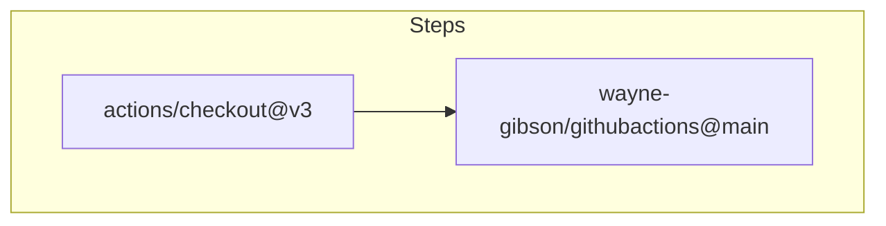
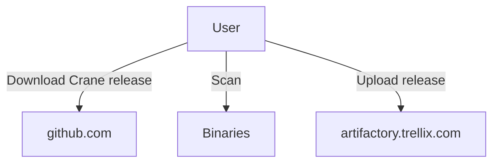
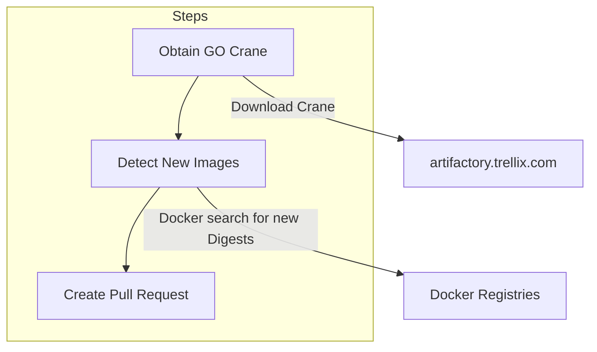

# Github actions

## Example steps using the action
Example of using workflow for using the action.

## Manual steps
To remediate pulling 3rd party binaries from the internet, the user will need to download the GO Crane binaries manually for now from https://github.com/google/go-containerregistry/releases and creating a new release within artifactory https://artifactory.trellix.com/ui/repos/tree/General/perinola-local/github-actions/crane  (To be change in the future)

## Steps for this action

